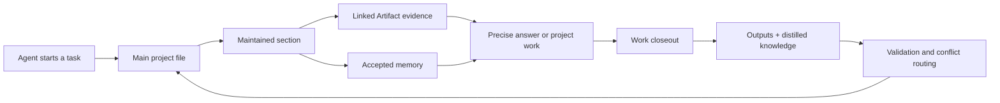

<div align="center">

# Argon Memory

### Durable project memory for agents that do real work

An open-source MCP knowledge system that turns documents, agent output, decisions, and verified conversations into a persistent, evidence-aware project memory.

[中文](README.zh-CN.md) · [Architecture](docs/architecture.md) · [MCP tools](docs/mcp-tools.md) · [Security](SECURITY.md)

</div>

---

Most agent memory systems save chat fragments. Argon Memory maintains a project.

It gives every connected agent the same compact project map, lets it retrieve exact evidence only when needed, and closes the loop by persisting durable outputs and distilled knowledge after work. Facts do not silently overwrite one another: provenance, revisions, validation state, and unresolved conflicts remain visible.

## Why Argon Memory

- **Project-shaped memory** — one stable main file, maintained domain sections, a knowledge graph, and linked Artifacts.
- **Token-efficient context** — load the small project map first; retrieve sections and evidence excerpts only when the task needs them.
- **Evidence before confidence** — accepted memory links to source records; unsupported candidates are quarantined instead of becoming facts.
- **Durable agent closeout** — work items, generated resources, decisions, lessons, and unresolved questions survive beyond a chat session.
- **Conflict-aware by design** — competing claims are disclosed and routed to an authorized human resolver; the model cannot silently pick a winner.
- **Append-only history** — immutable revision manifests, SHA-256 fingerprints, audit events, and supersession instead of destructive deletion.
- **MCP-native** — works with Codex, Claude Code, Qoder, Hermes, Cursor, or any Streamable HTTP MCP client.
- **Model-neutral** — the query path does not require an LLM. A separate, optional maintenance worker can use the model and provider you choose.

## Mental model



The layers have different jobs:

| Layer | Purpose |
|---|---|
| Main file | Stable identity, mission, current phase, navigation, and global rules |
| Sections | Long-lived synthesis for major project domains |
| Artifacts | Original files, normalized Markdown, images, tables, and generated deliverables |
| Structured memory | Facts, decisions, procedures, lessons, constraints, preferences, and open questions |
| Conflicts | Competing claims, evidence, status, resolver question, and preserved resolution history |
| Audit and revisions | Immutable publication history and reproducible current-state pointers |

## Quick start

Requirements: Node.js 22+; Python 3.10+ only when using the optional MinerU adapter.

```bash
git clone https://github.com/Tangtaizong-BUAA/ArgonMemory.git
cd ArgonMemory
npm install
npm run build

export ARGON_MEMORY_KB_ROOT="$PWD/data"
export ARGON_MEMORY_MCP_PROFILE="project-ops"
export ARGON_MEMORY_ALLOW_UNAUTHENTICATED="true" # local bootstrap only
npm start
```

The MCP endpoint is `http://127.0.0.1:8793/mcp`; health is available at `http://127.0.0.1:8793/health`.

Bootstrap the first project with `kb_bootstrap_project`:

```json
{
  "project_id": "project:my-product",
  "title": "My Product",
  "mission": "Maintain a trustworthy, durable operating memory for this product."
}
```

After bootstrap, run normal agents with the `project-contribute` profile and install the bundled [`argon-memory` Skill](skills/argon-memory/SKILL.md).

## Connect an MCP client

```json
{
  "mcpServers": {
    "argon_memory": {
      "url": "http://127.0.0.1:8793/mcp",
      "headers": {
        "Authorization": "Bearer ${ARGON_MEMORY_TOKEN}"
      }
    }
  }
}
```

For a local single-user experiment, omit the header only when `ARGON_MEMORY_ALLOW_UNAUTHENTICATED=true`. Never expose unauthenticated contribute or ops profiles to a network.

## The agent workflow

```text
kb_sync_skill → kb_brief → kb_graph_context → kb_search as needed
              → kb_start_work → publish/capture → kb_finish_work
```

1. `kb_brief` loads the complete compact project map.
2. `kb_graph_context` opens one maintained section and its linked evidence.
3. `kb_search` retrieves precise facts, names, dates, versions, quotations, and Artifact excerpts.
4. `kb_start_work` creates a durable task identity before material work begins.
5. `kb_publish_resource` stores useful outputs; `kb_capture_context` submits distilled memory candidates.
6. `kb_finish_work` records the outcome, evidence, unresolved items, and idempotent result hash.

This separation avoids two common failures: flooding every prompt with the whole archive and pretending that a short summary is sufficient evidence.

## Permission profiles

| Profile | Intended use | Capabilities |
|---|---|---|
| `project-read` | Read-only clients and replicas | Brief, graph, search, lookup, read, views |
| `project-contribute` | Normal team agents | Read tools plus work, Artifact, context, and closeout writes |
| `project-resolve` | Project owner or designated resolver | Locks explicit human conflict resolutions for maintenance |
| `project-ops` | Loopback operations service | Bootstrap, ingestion, normalization, lint, and health |

Principal tokens are stored as SHA-256 hashes in `ARGON_MEMORY_MCP_PRINCIPALS_JSON`. Resolver access additionally requires the `project-owner` or `designated-resolver` role. A shared token never proves which human spoke.

## Canonical storage

Argon Memory deliberately keeps human-inspectable Markdown and YAML frontmatter as canonical truth. Search indexes and graph views are derived and rebuildable.

```text
data/
├── registry/                 # projects, sections, work, Artifacts, conflicts
├── memory/                   # structured memory records
├── events/                   # durable activity records
├── resources/                # immutable uploaded bytes
├── normalized/               # parser-derived Markdown and media links
├── audit/events.jsonl        # append-only audit stream
├── maintenance/queue.sqlite  # bounded maintenance ChangePackets
└── knowledge/
    ├── revisions/            # immutable canonical snapshots
    ├── indexes/              # rebuildable derived indexes
    └── current-revision.json # atomic pointer to one consistent snapshot
```

No project data ships in this repository. The `data/` tree is created at runtime and ignored by Git.

## Artifact normalization

Text, Markdown, CSV, JSON, and YAML become searchable immediately. Binary documents remain immutable Artifacts until normalized.

MinerU Cloud is an optional adapter:

```bash
python3 -m pip install mineru-open-sdk
export MINERU_API_KEY="..."
```

Then an ops principal can register a source root, ingest inventory, and call `kb_parse_artifact`. The API egress is written to the audit log. Argon Memory is not coupled to MinerU's storage or model layer; other normalizers can write the same normalized Markdown contract.

## What is intentionally not included

- No chat UI or hosted online Agent.
- No command runner, container workspace, or remote execution plane.
- No project documents, user files, production database, credentials, or deployment secrets.
- No model that answers on behalf of connected clients.
- No test fixtures or test corpus in the published package.

Argon Memory is the memory layer. Your local or hosted agent remains the reasoning and execution layer.

## Status

`0.1.1` is the current standalone Argon release, extracted from a production project-memory system. The storage contract, MCP surface, provenance rules, and conflict boundaries are usable today; high-scale vector backends and additional normalizer adapters remain future work.

## Lineage and license

Argon Memory was derived from project-memory work built on the MIT-licensed [MinerU Document Explorer](https://github.com/opendatalab/MinerU-Document-Explorer). Argon Memory `0.1.1` and later are released under the [Apache License 2.0](LICENSE), including an explicit patent grant. Upstream attribution and the original MIT notice are preserved in [NOTICE](NOTICE) and [THIRD_PARTY_NOTICES.md](THIRD_PARTY_NOTICES.md).

## Contributors

Argon Memory is created and led by [Tangtaizong-BUAA](https://github.com/Tangtaizong-BUAA), with OpenAI Codex acknowledged as an AI engineering collaborator. Roles and attribution boundaries are documented in [CONTRIBUTORS.md](CONTRIBUTORS.md).

Contributions are welcome. Please read [CONTRIBUTING.md](CONTRIBUTING.md) and [SECURITY.md](SECURITY.md) before opening a pull request or reporting a vulnerability.
