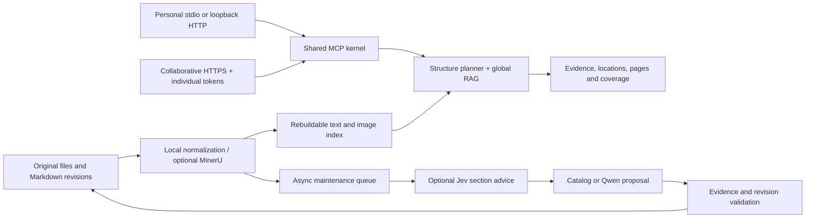
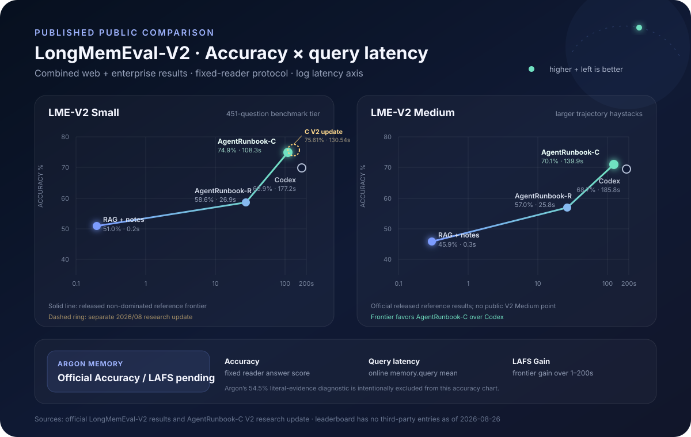
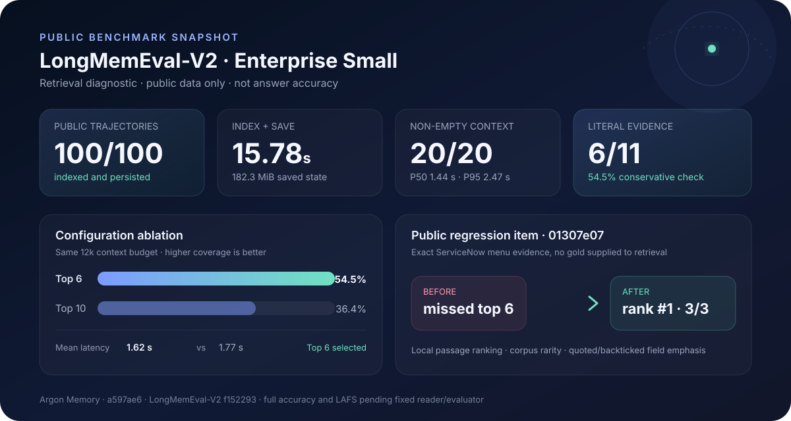

<div align="center">

# Argon Memory

### Structured knowledge and evidence retrieval for agents

A self-hosted MCP knowledge system that combines a complete project map with global text and image retrieval, source verification and durable agent work.

[中文](README.zh-CN.md) · [Architecture](docs/architecture.md) · [Deployment](docs/deployment.md) · [MCP tools](docs/mcp-tools.md) · [Benchmarks](benchmarks/README.md)

</div>

## Architecture upgrade · 0.2.0

Main files and maintained sections provide project orientation. Global RAG searches every visible registered source, including evidence outside the file tree. Results carry original-source locations, evidence URIs, revision-bound continuation and coverage gaps. Photos use real image pixels when the optional Qwen visual provider is enabled.


```mermaid
flowchart LR
  L[Personal stdio or loopback HTTP] --> M[Shared MCP kernel]
  C[Collaborative HTTPS + individual tokens] --> M
  M --> S[Structure planner + global RAG]
  O[Original files and Markdown revisions] --> N[Local normalization / optional MinerU]
  N --> I[Rebuildable text and image index]
  I --> S
  S --> E[Evidence, locations, pages and coverage]
  N --> Q[Async maintenance queue]
  Q --> J[Optional Jev section advice]
  J --> P[Catalog or Qwen proposal]
  P --> H[Evidence and revision validation]
  H --> O
```

Jev supplies bounded section-association advice after parsing and before maintenance proposals. It does not answer user queries or write canonical truth. Proposals pass the same source, hash, revision and conflict checks before atomic publication. Conflicts require an authorized human resolver.

## Two deployment modes

| Mode | Entry point | Ownership |
| --- | --- | --- |
| Personal | Client-managed stdio, authenticated loopback HTTP, or personal Docker | One deploying owner |
| Collaborative | Streamable HTTP behind your HTTPS endpoint | Separate reader, contributor, owner and operator tokens |

Both modes use one kernel and one data format. Normal MCP clients can connect without an OpenAI plugin. Uploaded originals, normalized files, Markdown revisions and audit records stay inspectable on disk.

## Quick start

Use Node.js 22 or 24. Python 3.10+ is needed for local PDF and image processing.

```sh
git clone https://github.com/Tangtaizong-BUAA/ArgonMemory.git
cd ArgonMemory
npm ci
npm run build
python3 -m pip install -r deploy/requirements.txt

node dist/cli.js init local --dir ./my-kb --name "My knowledge"
```

Merge the generated `my-kb/mcp.stdio.json` into your MCP client's configuration. It starts the MCP process and its indexer/maintainer. Install the generated `my-kb/client-skill` into the client's confirmed Skill directory. It contains this instance's project ID and verifies Skill updates by actual file hashes.

For a shared server:

```sh
node dist/cli.js init cloud --dir ./team-kb --name "Team knowledge" --public-url https://kb.example.org/mcp
node dist/cli.js serve --config ./team-kb/knowledge.config.json --http
node dist/cli.js member issue --config ./team-kb/knowledge.config.json --id alice --role contributor --out ./alice.private.json
```

Place your HTTPS proxy in front of loopback port 8793. Give each member their private invitation. Token revocation and role changes invalidate existing HTTP sessions. Docker configurations for both modes, client setup and provider configuration are in [deployment instructions](docs/deployment.md).

## Retrieval and maintenance boundaries

- Structure guides inspection; it never narrows the global recall set to linked files.
- Use `intent="collect"` and continuation calls for scattered evidence. Exhausting the current recall set does not prove all facts were found.
- Inspect parsing/embedding coverage and unresolved conflicts, then read original text or pixels with `kb_read`.
- External providers are **off by default**. Qwen enables semantic embeddings/reranking and optional maintenance; MinerU enables selected document/OCR processing; Jev enables bounded background routing advice. Without Qwen, retrieval reports its structure/lexical fallback.
- Unchanged source normalization and embeddings are reused. Lexical projection rebuilds on corpus revision changes; new searches rerank visible candidates. Vector search currently uses exact cosine, not ANN.
- The architecture introduction is claimed once per computer and deployment, with a persistent anonymous local identity. Clients without persistent local state skip it.

One managed deployment serves one shared project. Multiple teams need separate data directories, registries and processes; this release does not claim tenant isolation inside one server.

## Existing integrations and validation

Root library exports and the no-argument `ARGON_MEMORY_*` HTTP entry point remain available. They delegate to the shared kernel; existing benchmark adapters are preserved. See [upgrade boundaries](docs/architecture.md#upgrade-from-01x). Qwen retrieval on the legacy HTTP entry point requires explicit `ARGON_MEMORY_QWEN_ENABLED=true`.

```sh
npm run check
npm run build
npm test
npm run benchmark:smoke
```

Acceptance cases use temporary synthetic data and mocked external providers. They cover local stdio, cloud roles/revocation, evidence pagination, original pixels, normalization, retrieval caches and guarded maintenance. They do not measure whole-corpus retrieval accuracy or a production provider's current performance.

## Public benchmark

Published diagnostics below use the earlier 0.1.x retrieval implementation. The 0.2.0 architecture has not been assigned new benchmark scores.

Argon Memory includes an MCP-native adapter for the official [LongMemEval-V2](https://github.com/xiaowu0162/LongMemEval-V2) Agent memory benchmark. It evaluates long-horizon web and enterprise trajectories across five memory abilities while measuring answer quality and query latency. Synthetic cases are used only as smoke gates and are never reported as benchmark scores. See [benchmarks](benchmarks/README.md), the [reporting policy](docs/benchmarking.md), and the first [public retrieval diagnostic](docs/benchmark-results/2026-08-26-longmemeval-v2-public-retrieval.md).

[](benchmarks/README.md#published-memory-system-comparison)

The comparison above reproduces the official released RAG, AgentRunbook-R, Codex, and AgentRunbook-C accuracy/latency points and separately labels the AgentRunbook-C V2 research update. Argon's official answer accuracy and LAFS remain pending; the diagnostic below is retrieval-only and is not plotted as answer accuracy.

[](docs/benchmark-results/2026-08-26-longmemeval-v2-public-retrieval.md)

## Lineage and license

Argon Memory was derived from project-memory work built on the MIT-licensed [MinerU Document Explorer](https://github.com/opendatalab/MinerU-Document-Explorer). Argon Memory `0.1.1` and later are released under the [Apache License 2.0](LICENSE), including an explicit patent grant. Upstream attribution and the original MIT notice are preserved in [NOTICE](NOTICE) and [THIRD_PARTY_NOTICES.md](THIRD_PARTY_NOTICES.md).

## Contributors

Argon Memory is created and led by [Tangtaizong-BUAA](https://github.com/Tangtaizong-BUAA), with OpenAI Codex acknowledged as an AI engineering collaborator. Roles and attribution boundaries are documented in [CONTRIBUTORS.md](CONTRIBUTORS.md).

Contributions are welcome. Please read [CONTRIBUTING.md](CONTRIBUTING.md) and [SECURITY.md](SECURITY.md) before opening a pull request or reporting a vulnerability.
