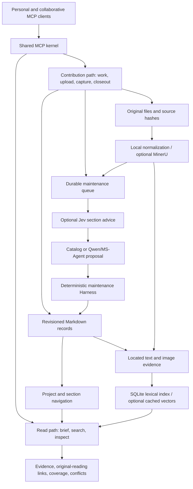

# Argon Memory

**A structured, evidence-based knowledge architecture for agents**

[中文](README.zh-CN.md) · [Deployment](docs/deployment.md) · [MCP reference](docs/mcp-tools.md) · [Implementation notes](docs/architecture.md) · [Evaluation](benchmarks/README.md)

## Abstract

Argon Memory is a self-hosted project knowledge system exposed through the Model Context Protocol (MCP). It combines maintained project documents, global text and image retrieval, source-level verification, and durable records of agent work. An agent can first understand a project's overall structure, then find evidence distributed across documents and photographs, inspect the originals, and contribute results for subsequent work.

The architecture separates **authoritative knowledge**, **retrieval projections**, and **maintenance proposals**. Revisioned Markdown records preserve project state and provenance; derived SQLite indexes support retrieval; background workers propose changes that must pass deterministic validation before publication. Optional Qwen, MinerU, and Jev integrations supply semantic retrieval, document processing, and section-association advice. Personal and collaborative deployments share the same kernel and storage model.

The design aims to make retrieval relevant, inspectable, and broad across registered sources. It exposes parsing gaps, incomplete embeddings, continuation state, and unresolved conflicts rather than treating a short result list as proof of completeness. Argon Memory supplies the knowledge layer of a retrieval-augmented generation (RAG) workflow; the connected agent remains responsible for reading evidence and producing the final answer.

## 1. Problem and design objectives

Project knowledge usually has two useful forms. A maintained document explains goals, decisions, and relationships coherently. Original materials preserve details: a method in a meeting note, an experiment in a report, or a photograph embedded in a presentation. Either form alone leaves a gap. Reading the overview cannot recover every source detail; retrieving a few similar fragments cannot establish the project's full context or identify what is missing.

Argon Memory therefore treats knowledge access as a coordinated process: **orientation → discovery → verification → contribution → maintenance**. Three objectives shape the system:

| Objective | Architectural mechanism | Observable result |
| --- | --- | --- |
| Preserve project context | Main document, topic sections, typed records, and explicit relationships | An agent obtains a project brief and a navigable map before investigating details |
| Find relevant, dispersed evidence | Global lexical and optional semantic retrieval, image retrieval, reranking, and source diversity | Evidence can be found outside the selected section or linked file tree |
| Accumulate knowledge responsibly | Durable work items, provenance, memory policy, versioned proposals, and conflict resolution | Work can be traced to its sources and reviewed before it changes maintained knowledge |

“Comprehensive” has a defined scope: registered sources visible to the requesting identity at the current corpus revision. Unregistered files, unreadable content, and inaccessible material remain outside that scope. Within it, coverage reporting and iterative collection help an agent detect and investigate omissions.

## 2. System architecture

The shared TypeScript kernel serves both stdio and authenticated Streamable HTTP MCP clients. Its read path assembles context and evidence. Its contribution path records work and original materials. Parsing, indexing, and document maintenance run in background processes, so a query does not wait for a maintenance proposal to finish.


```mermaid
flowchart TB
  C["Personal and collaborative MCP clients"] --> M["Shared MCP kernel"]
  M --> Q["Read path: brief, search, inspect"]
  M --> W["Contribution path: work, upload, capture, closeout"]
  W --> K["Revisioned Markdown records"]
  W --> O["Original files and source hashes"]
  K --> S["Project and section navigation"]
  K --> E["Located text and image evidence"]
  O --> N["Local normalization / optional MinerU"]
  N --> E
  E --> I["SQLite lexical index / optional cached vectors"]
  S --> Q
  I --> Q
  Q --> R["Evidence, original-reading links, coverage, conflicts"]
  W --> J["Durable maintenance queue"]
  N --> J
  J --> V["Optional Jev section advice"]
  V --> P["Catalog or Qwen/MS-Agent proposal"]
  P --> H["Deterministic maintenance Harness"]
  H --> K
```

Three invariants connect these components:

1. **One authoritative record system.** Search indexes, vectors, and generated views can be rebuilt; they do not constitute a competing fact store.
2. **Structure guides discovery without enclosing it.** Topic navigation supplies a search plan and preferences. Global retrieval still considers the visible corpus beyond those links.
3. **Model output is a proposal.** A similarity score is not a truth assessment, and a maintenance model cannot grant itself permission to publish or resolve a dispute.

The project graph consists of typed record references. It supports context expansion and source navigation without requiring a separate graph database.

## 3. Knowledge and evidence model

### 3.1 Records and relationships

Canonical records are Markdown documents with YAML frontmatter. Common fields include a stable `id`, `type`, `project_id`, `status`, authorship, timestamps, source references, and confidentiality. The Markdown body holds readable content; frontmatter supplies machine-readable relationships and lifecycle state.

| Record | Responsibility |
| --- | --- |
| `project` | Project identity, mission, main document, and topic entry points |
| `knowledge_section` | Maintained topic document with parent, child, artifact, and related-record references |
| `artifact` | Registered source or generated resource, original-byte hash, processing state, and derivative locations |
| `memory` | Scoped fact, decision, procedure, lesson, constraint, preference, or open question with evidence references |
| `work_item` | Objective, expected outputs, acceptance criteria, inputs, checkpoints, and outcome of agent work |
| `conflict` / `user_conflict_resolution` | Competing claims and a version-bound, authorized user directive |
| `validation_event` | Policy decision and trace for a submitted memory |

References such as `artifact_refs`, `source_refs`, `parent_ref`, and `child_section_refs` connect the records. A source can support several sections; its evidence need not be duplicated into every document. Deep topic hierarchies remain navigable, while unlinked artifacts remain eligible for global retrieval.

### 3.2 Sources, derivatives, and evidence units

Original files are retained with their byte hashes. Normalized Markdown, extracted images, and parse reports preserve the connection between the source and its searchable representation. Text is divided into overlapping evidence units; images become separate units associated with their surrounding document context.

An evidence unit carries its source record, project, status, confidentiality, content hash, corpus revision, URI, and location. Text locations include line/character ranges, heading paths, and page markers where available. Format-specific slide, sheet, and cell information is preserved in normalization output. Image units carry image locations and verified pixel hashes.

This establishes three distinct meanings:

- A maintained section explains the project's current understanding.
- A retrieved unit identifies potentially relevant evidence.
- Reading the source establishes what that source actually says or shows.

An `accepted` memory has passed the implemented policy gates. Those gates check requirements such as evidence references, authoritative directives for certain memory kinds, and competing scoped claims. They do not independently prove every statement or perform general semantic contradiction detection.

### 3.3 Storage and publication

The active canonical snapshot is selected by `knowledge/current-revision.json`. Each published revision contains a manifest and `canonical/registry`, `canonical/memory`, and `canonical/events` directories. Publication stages a new snapshot, records its parent and hashes, and atomically changes the active pointer.

Original contributions live under `agent-resources/`; document derivatives under `normalized/`; retrieval data under `knowledge/indexes/`; maintenance jobs in `maintenance/jobs.sqlite`; operational audit entries in `audit/events.jsonl`. These have different lifetimes: canonical revisions and original sources preserve history, retrieval projections are rebuildable, and the durable queue preserves pending work.

## 4. Retrieval: context, recall, and verification

### 4.1 Define visibility before ranking

Let `E_r` denote evidence at corpus revision `r`. For principal `u` and project `p`, the retrieval universe is:

```text
V_r(u, p) = evidence in E_r allowed by project, identity, confidentiality, and status
```

Project, confidentiality, history, and verification-state filters are applied before candidate selection. Historical and unverified records are excluded by default. Retrieval uses actual maintained sections to identify likely topics and sources, but this plan does not replace `V_r` with a smaller section subtree.

### 4.2 Hybrid retrieval

Text retrieval combines SQLite FTS5/BM25 with Chinese bigram tokenization, optional Qwen embeddings, structure/source preferences, and optional reranking. Text ranking channels use reciprocal rank fusion. Image retrieval uses a separate visual relevance path so metadata matches cannot dominate available visual evidence.

Source diversity rotates comparable results among sources. Exact-content duplicates are deferred rather than permanently discarded, preserving their separate provenance for collection. The response discloses active channels, provider configuration, and fallback conditions. With Qwen disabled, the system provides structural and lexical retrieval; it does not label that fallback as semantic retrieval.

### 4.3 Collect dispersed information

`kb_search` supports two intents. `answer` returns a bounded ranked window suitable for a focused question. `collect` supports pagination through the current recall set, which is useful for questions such as “collect the practical methods distributed across this project's materials.”

A collection cursor binds the query, filters, and corpus revision to a saved ranking. The agent follows the returned `next_call`, inspects coverage, and uses `source_ids` for focused searches over planned sources missing from the current page. A changed scope, changed revision, or expired snapshot requires a new collection.

The response reports registered/parsed source coverage, missing document bodies, unavailable images, embedding coverage, planned sources without content, and related open conflicts. **End of pagination means the current recall set is exhausted. It does not mean every relevant fact has been discovered.**

### 4.4 Read and synthesize

The agent uses `kb_outline` to choose document sections, `kb_read` to inspect located text or original pixels, and `kb_graph_context` to expand related records and sources. Text reading has revision-bound continuation rather than silent truncation. The agent then synthesizes an answer with source references and any remaining gaps or conflicts.

For example, an image collection starts with these `kb_search` arguments, using the actual project ID from the deployment configuration:

```json
{
  "project_id": "<project-id>",
  "query": "Team group photographs from fieldwork",
  "modality": "image",
  "intent": "collect",
  "top_k": 12
}
```

The client follows continuation calls and reads returned image URIs. Titles and captions can help locate a photograph; identifying its visible content requires looking at the image.

## 5. Document processing and multimodal access

Local processing converts supported sources into inspectable evidence without sending them to a model service. Input/output bounds, path checks, hash validation, and staged publication protect the normalization boundary. Documents are parsed as data; macros, spreadsheet formulas, and embedded instructions are not executed.

| Source | Local representation | Optional extension |
| --- | --- | --- |
| Markdown, UTF-8 text, CSV, JSON, YAML | Searchable text with document structure | Qwen semantic text retrieval and reranking |
| DOCX | Paragraphs, headings, tables, and extracted images | Provider-assisted processing where configured |
| PPTX | Slides, text, tables, notes, and extracted images | Qwen visual retrieval over eligible images |
| XLSX | Sheets, cell coordinates, tables, and cached formula values | Semantic retrieval over normalized text |
| PDF | Local text extraction, page markers, and extracted images | Explicitly enabled MinerU processing/OCR for eligible sources |
| PNG, JPEG, GIF, WebP | Original pixels, metadata, and image evidence | Qwen visual embeddings and visual reranking |

Scanned PDFs without usable text and OCR produce a coverage gap. Unsupported, missing, oversized, or invalid images are reported rather than represented as successfully indexed visual evidence. Original-image reading and compact previews are available independently of visual-semantic retrieval.

External integrations are independently configured:

| Integration | Position in the architecture | Material processed | Default |
| --- | --- | --- | --- |
| Qwen | Retrieval and optional maintenance proposal generation | Eligible text/image payloads, queries, and bounded maintenance context | Off |
| MinerU | Document normalization/OCR | Original files selected for eligible parsing operations | Off |
| Jev | Section-association advice before maintenance proposals | Filtered source excerpts and existing section descriptions | Off |

Enabling an integration is an explicit deployment choice. Credentials alone do not enable it. Reading permissions and provider egress eligibility are separate checks; enabling a model does not make every readable source eligible for external processing. The default deployment uses local parsing, lexical retrieval, image reading, and model-free source-catalog maintenance.

## 6. Durable work and background maintenance

### 6.1 Contribution lifecycle

An agent starts a `work_item` with its objective and acceptance criteria, publishes original resources, captures useful context, and closes the work with an outcome and evidence references. Small resources use `kb_publish_resource`; larger files use begin/append/commit upload calls with size and hash verification.

Registration, parsing, indexing, memory acceptance, and maintained-document publication are separate states. Successful upload establishes that a resource was stored; it does not establish that all parsing, semantic indexing, or document maintenance has completed. Work closeout records completed, partial, failed, or cancelled outcomes without promoting the entire conversation into authoritative knowledge.

### 6.2 Change packets and proposals

Relevant events enqueue a bounded `ChangePacket`: project identity, base revisions, evidence references, candidate sections, open conflicts, and processing budgets. A SQLite queue supplies idempotency, leases, retry handling, quarantine, and dead-letter state. The maintainer refreshes the packet before generating a proposal.

Two proposal modes share the same publication boundary:

- **`catalog`** adds source-navigation sections for newly parsed eligible artifacts. It requires no model and does not synthesize claims or decide conflicts.
- **`qwen`** uses the Qwen/MS-Agent adapter to propose section/main patches, new sections, relationship changes, and conflict observations within a bounded contract.

### 6.3 Jev's role

Jev is an optional advisor between evidence preparation and proposal generation. It evaluates whether source excerpts discuss existing section topics. A source can belong to several topics, and a deep child section is evaluated independently of its parent's match. These judgments concern association, not factual truth.

`off` makes no Jev request; `shadow` records advice while preserving the existing candidates; `advisory` may add eligible candidates without removing existing ones. Routing inputs are bounded and restricted to eligible same-project public/internal parsed artifacts or accepted memories. Stale, disputed, quarantined, restricted, and cross-project material cannot become routing evidence. Source/revision changes invalidate advice; failures fall back to the deterministic route. Jev does not sit in the user-query path and cannot write canonical records.

### 6.4 Validated publication and conflicts

The maintenance Harness is deterministic validation and commit code. It checks the plan contract, project and packet scope, evidence eligibility, expected revisions, target blocks and hashes, and protected conflict rules. Missing required evidence or version fields are rejected rather than invented to make a proposal pass. Valid document changes publish together as a new canonical revision.

Conflicts remain explicit records. An authorized owner or designated resolver submits a user directive bound to the current conflict revision and statement hash. This creates a locked resolution and `resolution_pending` state. A matching typed resolution must subsequently pass the maintenance path before its outcome is applied; model confidence alone cannot resolve it. Catalog maintenance does not perform that adjudication.

The Harness establishes contract and provenance consistency. Semantic correctness still depends on the quality of source material, proposal content, and human decisions.

## 7. Consistency, incremental processing, and scale

The system combines atomic canonical publication with asynchronous derivative processing. A new source may be registered before its text or vectors are ready. Queries use the available corpus and disclose the remaining gaps; they do not hide that lag behind a general “ready” flag.

Atomic publication applies to a canonical revision. Storing original bytes, registering an artifact, building vectors, and completing a queue job are separate operations, so clients must inspect the receipt and state of each stage.

Incrementality is component-specific:

| Component | Reused work | Work still required |
| --- | --- | --- |
| Normalization / evidence assembly | Unchanged source derivatives and record fingerprints | Changed/new sources need extraction and evidence assembly |
| Embeddings | Content hashes plus provider/model/dimension configuration identify cached vectors | Missing eligible vectors need provider calls; a different vector space needs rebuilding |
| Lexical index | The current projection is reused while the corpus revision is unchanged | A changed corpus revision currently rebuilds the lexical projection |
| Query ranking | Query-vector caching, a short ranking cache, and collection snapshots | New queries or changed revisions rank visible candidates again |
| Maintenance | Idempotent queued events and bounded affected-source packets | Proposals still require validation against the current canonical state |

Vector search currently computes exact cosine similarity over visible units, with `O(N × D)` work for `N` units of dimension `D`. It does not use an approximate nearest-neighbor (ANN) service. Large-corpus latency, storage growth from canonical snapshots, and provider cost must therefore be measured in the deployment's workload. There is no corpus-independent speed or recall guarantee.

## 8. Deployment and access control

| Mode | Transport and lifecycle | Access model |
| --- | --- | --- |
| Personal | Client-managed stdio, authenticated loopback HTTP, or personal Docker deployment | One deploying owner; local mode rejects additional members |
| Collaborative | Authenticated Streamable HTTP behind the deployer's HTTPS endpoint | Independent member tokens and role-specific tool capabilities |

Both modes use the same data format, retrieval logic, and maintenance contracts. A managed deployment serves one project. Separate teams require separate data directories, registries, and processes; a project filter inside a query is not a substitute for tenant authorization.

Cloud roles separate responsibility:

| Role | Capability |
| --- | --- |
| `reader` | Project context, navigation, search, source reading, and Skill synchronization |
| `contributor` | Reader capabilities plus work records, uploads, context capture, and closeout |
| `owner` | Contributor capabilities plus submission of explicit user conflict resolutions |
| `operator` | Contributor capabilities plus ingestion, parsing, coverage, and operational controls; no conflict adjudication |

The principal registry stores token SHA-256 digests. Private invitation files contain client credentials; credentials are not embedded in Skills. Each HTTP request rechecks the current registry, and revoked or changed identities invalidate existing sessions. Audit actors come from the authenticated principal, not caller-supplied tool arguments.

Query, indexer, and maintainer processes may run separately. Configure one long-running maintainer per canonical root; queue leases and revision checks handle retries and stale proposals. Native and Docker deployment instructions, private configuration, and HTTPS setup are documented in [the deployment guide](docs/deployment.md).

## 9. Agent protocol and client Skills

Ordinary MCP clients can use Argon Memory without an OpenAI plugin. The optional client Skill describes the knowledge workflow and carries instance-specific project configuration. Each deployment generates its own Skill release with actual file hashes.

The intended agent workflow is:

```text
kb_sync_skill → kb_brief / kb_lookup
             → kb_search → kb_outline / kb_read / kb_graph_context
             → kb_start_work → publish resources / capture context → kb_finish_work
```

`kb_sync_skill` compares installed versions and file hashes, supplies changed managed files and explicit removals, and supports verification after replacement. Clients install files only in their confirmed Skill directory. When installation is unavailable, agents can continue with live MCP tool contracts and control information.

A separate notice protocol issues an introduction at most once per anonymous computer identity and deployment. Its marker persists outside the Skill directory. The claim is recorded before delivery, so a dropped response can lose the notice but does not cause repeated announcements. Clients without persistent local state skip the introduction.

Detailed tool inputs and continuation behavior are in the [MCP reference](docs/mcp-tools.md).

## 10. Running the system

Use Node.js 22 or 24 and Python 3.10+ for local PDF/image processing. Initialize a new directory:

```sh
git clone https://github.com/Tangtaizong-BUAA/ArgonMemory.git
cd ArgonMemory
npm ci
npm run build
python3 -m pip install -r deploy/requirements.txt
node dist/cli.js init local --dir ./my-kb --name "My knowledge"
```

Merge `my-kb/mcp.stdio.json` into the MCP client's configuration and install `my-kb/client-skill` in the client's supported Skill directory. The client starts the service and background workers. Initialization creates an empty project; it does not scan unrelated computer files. Add sources through contribution tools or explicitly configured ingestion.

For a collaborative server:

```sh
node dist/cli.js init cloud --dir ./team-kb --name "Team knowledge" --public-url https://kb.example.org/mcp
node dist/cli.js serve --config ./team-kb/knowledge.config.json --http
```

Configure an HTTPS proxy to the loopback MCP service, then issue an individual invitation in another terminal:

```sh
node dist/cli.js member issue --config ./team-kb/knowledge.config.json --id alice --role contributor --out ./alice.private.json
```

Members use `client configure`, `client skill`, and `client doctor` with their private invitation. Personal and cloud Docker templates are under [`deploy/`](deploy/README.md).

To enable semantic retrieval, supply a deployment-owned key in private `secrets.env`, explicitly enable Qwen, and restart services. Qwen maintenance is a separate choice:

```sh
node dist/cli.js config providers --config ./my-kb/knowledge.config.json --qwen on
node dist/cli.js config providers --config ./my-kb/knowledge.config.json --maintenance qwen
```

Install the optional provider dependencies before model-assisted maintenance. MinerU/OCR and Jev are configured independently. See [provider setup](docs/deployment.md#启用-qwenmineru-和-jev) for dependencies, keys, and restart requirements. Coverage can be inspected with:

```sh
node dist/cli.js status --config ./my-kb/knowledge.config.json
```

## 11. Evaluation and current limits

The repository distinguishes interface correctness from retrieval quality and final-answer quality.

| Evidence | What it establishes | What remains outside the claim |
| --- | --- | --- |
| Synthetic integration/regression tests | MCP transports, roles/revocation, upload integrity, source reading, pagination, caches, and maintenance boundaries | Recall/precision on an entire real corpus |
| LongMemEval-V2 adapter and persistence smoke gate | Public MCP ingestion/query integration and persisted reload | Official end-to-end answer accuracy or LAFS |
| OmniMemEval adapter and project-isolation smoke gate | Compatibility with the evaluation pipeline and scoped benchmark projects | A completed reproduced cross-system ranking |
| Published 2026-08-26 retrieval diagnostic | Retrieval behavior on its declared public slice and configuration | Scores for the current architecture or a leaderboard result |

The published diagnostic used the earlier 0.1.x implementation. Current source version 0.2.0 has no newly assigned full benchmark score. Formal answer accuracy and comparative performance remain pending. See the [evaluation index](benchmarks/README.md), [reporting policy](docs/benchmarking.md), and [historical retrieval report](docs/benchmark-results/2026-08-26-longmemeval-v2-public-retrieval.md).

Local validation commands are:

```sh
npm run check
npm run build
npm test
npm run test:search
npm run benchmark:smoke
```

Important system limits follow from the design: source coverage is bounded by registration and permissions; parser quality constrains evidence; finite recall/reranking budgets can miss relevant material; visual retrieval requires eligible indexed pixels and an enabled provider; policy acceptance is not universal fact verification; exact vector search and snapshot publication have scaling costs. These are evaluation targets, not assumed solved properties.

## 12. Implementation map

| Path | Responsibility |
| --- | --- |
| [`src/project/runtime.ts`](src/project/runtime.ts) | Records, work lifecycle, evidence access, retrieval coordination, and maintenance application |
| [`src/project/revision-store.ts`](src/project/revision-store.ts) | Canonical snapshots, manifests, and atomic publication |
| [`src/project/retrieval/`](src/project/retrieval/) | Evidence assembly, normalization, structural planning, indexes, Qwen providers, reading, and previews |
| [`src/project/maintenance/`](src/project/maintenance/) | Change-packet/plan contracts, durable queue, Jev advice, and MS-Agent adapter |
| [`src/project/deployment/`](src/project/deployment/) | Local/cloud configuration, member management, client setup, and maintenance workers |
| [`src/mcp/`](src/mcp/) / [`src/cli/`](src/cli/) | MCP tools/transports and deployment commands |
| [`src/backends/python/`](src/backends/python/) | Local document/image processing and model-maintenance worker |
| [`skills/argon-memory/`](skills/argon-memory/) | Client workflow, update contract, and device-notice helper |
| [`benchmarks/`](benchmarks/) | Public evaluation adapters, persistence gates, and reporting entry points |

The package also exports a library API through [`src/index.ts`](src/index.ts). Root compatibility modules and the environment-configured HTTP entry point delegate to the shared kernel. [`architecture-sync.json`](architecture-sync.json) records implementation lineage; it is not a knowledge database or an evaluation result.

## License and contributors

Argon Memory is created and led by [Tangtaizong-BUAA](https://github.com/Tangtaizong-BUAA), with OpenAI Codex acknowledged as an AI engineering collaborator. Attribution and responsibility are described in [CONTRIBUTORS.md](CONTRIBUTORS.md).

The project is derived from work built on the MIT-licensed [MinerU Document Explorer](https://github.com/opendatalab/MinerU-Document-Explorer). Argon Memory 0.1.1 and later use the [Apache License 2.0](LICENSE). Upstream attribution and the original MIT notice are preserved in [NOTICE](NOTICE) and [THIRD_PARTY_NOTICES.md](THIRD_PARTY_NOTICES.md).

For contributions and vulnerability reporting, read [CONTRIBUTING.md](CONTRIBUTING.md) and [SECURITY.md](SECURITY.md).
