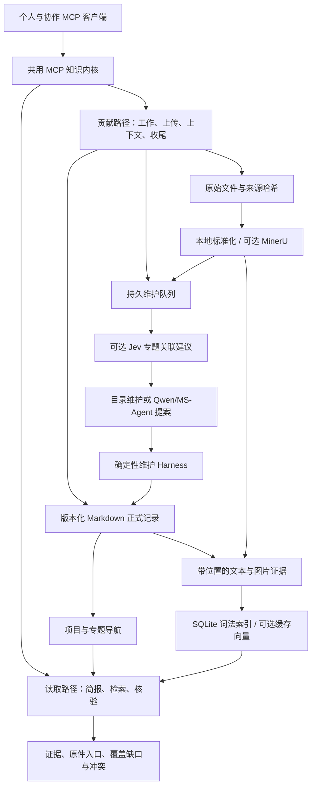

# Argon Memory

**面向智能体的结构化、证据驱动知识架构**

[English](README.md) · [部署指南](docs/deployment.md) · [MCP 工具](docs/mcp-tools.md) · [实现说明](docs/architecture.md) · [评测](benchmarks/README.md)

## 摘要

Argon Memory 是一个通过模型上下文协议（Model Context Protocol，MCP）向智能体提供服务的自部署项目知识系统。它把持续维护的项目文档、跨资料的文本与图片检索、原始证据核验，以及智能体工作记录放在同一套架构中。智能体可以先理解项目全貌，再寻找散落在文档与照片中的依据，阅读原件，并将工作成果保存下来供后续使用。

系统将**正式知识、检索投影和维护提案**分开：带版本的 Markdown 记录保存项目状态与来源关系，派生的 SQLite 索引支撑检索，后台进程提出的整理方案通过确定性校验后才能提交。Qwen、MinerU 和 Jev 分别为语义检索、文档处理和专题关联建议提供可选能力。个人电脑与多人云端服务共用相同的知识内核和存储模型。

这套设计追求相关、可核查且覆盖广泛的知识获取。解析缺口、未完成的向量、续页状态和开放冲突都会显式返回，避免把少量命中等同于信息完整。Argon Memory 提供检索增强生成（Retrieval-Augmented Generation，RAG）中的知识层；接入的智能体负责阅读证据并形成最终回答。

## 1. 问题定义与设计目标

项目知识通常有两种有用的形态。维护良好的文档能够连贯地说明目标、决策与关系；原始资料保留具体细节，例如会议记录中的方法、报告中的实验结果，以及演示文稿里的合照。只读概览无法还原所有细节，只检索几个相似片段又难以判断项目上下文和信息缺口。

因此，Argon Memory 将知识获取组织成一个连续过程：**理解全貌 → 发现证据 → 核验原件 → 贡献成果 → 维护知识**。系统围绕三个目标展开：

| 目标 | 架构机制 | 可观察的结果 |
| --- | --- | --- |
| 保留项目全貌 | 主文件、专题分文件、带类型的记录与显式关系 | 智能体在查细节前获得项目简报与可导航的知识地图 |
| 找到相关且分散的证据 | 全局词法与可选语义检索、图片检索、重排和来源多样性 | 证据可以从所选专题和已关联文件树之外被发现 |
| 有依据地积累知识 | 持久工作项、来源记录、记忆准入规则、版本化提案与冲突裁决 | 工作成果可以追溯到依据，并在改变维护文档前接受校验 |

这里的“全面”有明确范围：当前语料版本中，已登记且对请求身份可见的来源。未登记文件、无法读取的内容及权限外资料不在这一范围内。覆盖报告和迭代收集帮助智能体在范围内发现缺口并继续查证。

## 2. 系统总体架构

共享的 TypeScript 内核同时服务 stdio 和经过认证的 Streamable HTTP MCP 客户端。读取路径组织上下文与证据，贡献路径保存工作和原始资料。解析、索引与文档维护在后台运行，查询无需等待某份维护提案处理完毕。



组件之间遵循三条约束：

1. **正式记录只有一套。** 搜索索引、向量和生成视图均可重建，不构成另一份相互竞争的事实库。
2. **结构引导发现，但不圈定召回。** 专题导航提供检索计划和优先线索，全局检索仍覆盖这些关联之外的可见语料。
3. **模型输出是提案。** 相似度不是事实真实性，维护模型也不能自行取得提交知识或裁决争议的权限。

项目图由带类型的记录引用组成，用于展开上下文与导航来源，无需另外部署图数据库。

## 3. 知识与证据的数据模型

### 3.1 记录及其关系

正式记录采用带 YAML frontmatter 的 Markdown 文档。共有字段包括稳定的 `id`、`type`、`project_id`、`status`、作者、时间、来源引用与保密等级。Markdown 正文保存可读内容，frontmatter 保存机器可读的关系及生命周期状态。

| 记录 | 职责 |
| --- | --- |
| `project` | 项目标识、使命、主文件与专题入口 |
| `knowledge_section` | 持续维护的专题文档，关联父子专题、原始资料和相关记录 |
| `artifact` | 已登记来源或生成资源，记录原件哈希、处理状态及派生文件位置 |
| `memory` | 带作用范围和证据引用的事实、决策、流程、经验、约束、偏好或开放问题 |
| `work_item` | 智能体工作的目标、预期产物、验收条件、输入、检查点与结果 |
| `conflict` / `user_conflict_resolution` | 相互竞争的陈述，以及绑定版本的授权用户裁决 |
| `validation_event` | 一条提交记忆的规则判定和追踪记录 |

`artifact_refs`、`source_refs`、`parent_ref` 和 `child_section_refs` 等字段连接这些记录。同一来源可以支撑多个专题，证据不必复制到每份文档里。深层专题可沿关系下钻，尚未关联专题的资料仍可进入全局检索。

### 3.2 原件、派生内容与证据单元

系统保留原始文件及其字节哈希。标准化 Markdown、提取图片和解析报告维持原件与可检索内容之间的对应关系。文本被切分为有重叠的证据单元，图片则成为独立单元并关联周围的文档上下文。

证据单元包含来源记录、项目、状态、保密等级、内容哈希、语料版本、URI 与位置。文本位置包括行号、字符范围、标题路径，以及能够提取的页码；幻灯片、工作表和单元格信息保留在对应的标准化输出中。图片单元保留位置和经过核验的像素哈希。

这使三种信息各有明确含义：

- 维护文档解释项目当前的认知。
- 检索片段指出可能相关的证据。
- 阅读原件确认该来源实际说了什么、展示了什么。

一条 `accepted` 记忆表示它通过了当前实现的准入规则。这些规则检查证据引用、某些记忆类型所需的权威指令，以及相同作用范围内的竞争陈述；它们并不独立证明每条陈述，也不具备通用的语义矛盾识别能力。

### 3.3 存储与发布

`knowledge/current-revision.json` 指向当前正式快照。每个发布版本包含清单，以及 `canonical/registry`、`canonical/memory` 和 `canonical/events` 目录。提交先构建新快照，记录父版本和哈希，再原子切换当前版本指针。

贡献原件位于 `agent-resources/`，标准化派生文件位于 `normalized/`，检索数据位于 `knowledge/indexes/`，维护任务位于 `maintenance/jobs.sqlite`，运行审计追加到 `audit/events.jsonl`。它们承担不同职责：正式版本和原件保留历史，检索投影可重建，持久队列保留尚未处理的工作。

## 4. 检索机制：上下文、召回与核验

### 4.1 先确定可见范围，再排序

设 `E_r` 是语料版本 `r` 中的证据集合，身份 `u` 查询项目 `p` 时，其检索范围为：

```text
V_r(u, p) = E_r 中满足项目、身份、保密等级及状态要求的证据
```

项目、保密等级、历史状态与验证状态的过滤发生在候选选择之前。历史和未验证记录默认排除。系统根据实际维护的专题规划可能相关的主题与来源，但不会把 `V_r` 缩小为某个专题子树。

### 4.2 混合检索

文本通道结合支持中文 bigram 的 SQLite FTS5/BM25、可选 Qwen 向量、结构及来源偏好，以及可选重排。文本排序通道通过倒数排名融合（Reciprocal Rank Fusion，RRF）组合。图片使用独立的视觉相关性路径，在视觉证据可用时，避免仅凭文件名等元数据压过像素匹配。

来源多样性在分数相近的结果之间轮换来源。内容完全相同的副本延后展示而不永久丢弃，收集时仍可保留各自出处。响应说明实际启用的通道、模型配置及降级条件。关闭 Qwen 时，系统提供结构与词法检索，明确说明此时没有语义检索能力。

### 4.3 收集分散信息

`kb_search` 提供两种意图。`answer` 返回适合具体问题的有限排序窗口；`collect` 支持遍历当前召回集合，适合“收集散落在各份资料中的实践方法”这类任务。

收集游标将查询、过滤条件和语料版本绑定到一份已保存的排序。智能体执行响应中的 `next_call`，检查覆盖情况，再使用 `source_ids` 定向搜索本页未命中的计划来源。查询范围、版本发生变化，或排序快照过期时，需要重新开始收集。

响应会说明登记及解析覆盖、缺失正文、不可用图片、向量覆盖、没有内容的计划来源和相关开放冲突。**翻到最后一页，只代表当前召回集合已遍历完毕，不能证明所有相关事实都已找到。**

### 4.4 阅读与回答

智能体通过 `kb_outline` 选择文档章节，通过 `kb_read` 查看定位文本或原始像素，通过 `kb_graph_context` 展开相关记录和来源。文本读取提供绑定版本的续读机制，避免截断后没有提示。随后，智能体基于已读证据形成回答，并注明出处、剩余缺口或冲突。

例如，收集合照可以从下面的 `kb_search` 参数开始；项目 ID 使用部署配置中的实际值：

```json
{
  "project_id": "<project-id>",
  "query": "团队实地实践中的合照",
  "modality": "image",
  "intent": "collect",
  "top_k": 12
}
```

客户端继续执行续页调用，并读取返回的图片 URI。标题与说明能够帮助定位照片，确认画面内容则需要查看图片本身。

## 5. 文档处理与多模态访问

本地处理将支持的原件转换为可检查的证据，无需把它们发送到模型服务。输入输出预算、路径检查、哈希验证和暂存发布共同约束标准化边界。文档被当作数据解析，不执行宏、表格公式或其中夹带的指令。

| 来源 | 本地表示 | 可选扩展 |
| --- | --- | --- |
| Markdown、UTF-8 文本、CSV、JSON、YAML | 带文档结构的可检索文本 | Qwen 文本语义检索与重排 |
| DOCX | 段落、标题、表格与提取图片 | 按配置选择服务辅助处理 |
| PPTX | 幻灯片、文本、表格、备注与提取图片 | 对符合条件的图片进行 Qwen 视觉检索 |
| XLSX | 工作表、单元格坐标、表格与已有公式缓存值 | 对标准化文本进行语义检索 |
| PDF | 本地文本提取、页码标记与提取图片 | 显式启用的 MinerU 解析或 OCR |
| PNG、JPEG、GIF、WebP | 原始像素、元数据与图片证据 | Qwen 视觉向量与视觉重排 |

扫描 PDF 若没有可用文本且未执行 OCR，会产生覆盖缺口。不支持、缺失、过大或无效的图片也会明确报告，不会被当作已完成视觉索引。原图读取与紧凑预览可独立于视觉语义检索使用。

外部服务分别配置：

| 服务 | 所在环节 | 处理的材料 | 默认状态 |
| --- | --- | --- | --- |
| Qwen | 检索与可选维护提案生成 | 符合条件的文本、图片、查询及有预算的维护上下文 | 关闭 |
| MinerU | 文档标准化与 OCR | 明确选择且符合解析条件的原件 | 关闭 |
| Jev | 维护提案前的专题关联建议 | 过滤后的原文片段和已有专题描述 | 关闭 |

启用服务是部署者明确作出的配置选择，仅填入密钥不会开启它。读取权限与服务外发资格分别检查，启用模型也不会使所有可读来源都具备外发资格。默认部署使用本地解析、词法检索、图片读取和无需模型的来源目录维护。

## 6. 工作沉淀与异步维护

### 6.1 贡献生命周期

智能体以目标和验收条件创建 `work_item`，发表原始资源，捕获有价值的上下文，再提交工作结果与证据引用。较小资源通过 `kb_publish_resource` 保存，较大文件通过开始上传、追加分块和提交接口写入，并验证总大小与哈希。

登记、解析、索引、记忆接纳和维护文档发布是独立状态。上传成功证明资源已经保存，不代表解析、语义索引或文档整理全部完成。工作收尾保留完成、部分完成、失败和取消等结果，不会将整段对话直接晋升为正式知识。

### 6.2 变更包与提案

相关事件生成有预算的 `ChangePacket`，包含项目身份、基准版本、证据引用、候选专题、开放冲突及处理预算。SQLite 队列提供幂等、租约、重试、隔离和死信状态。维护器在生成提案前刷新变更包。

两种提案方式通过相同的发布边界：

- **`catalog`** 为新解析且符合条件的来源创建导航专题，不需要模型，也不从原文推理陈述或裁决冲突。
- **`qwen`** 通过 Qwen/MS-Agent 适配器，在有预算的契约内提出主文件或专题修改、新专题、关系变化及冲突观察。

### 6.3 Jev 的职责

Jev 位于证据准备与维护提案生成之间，判断原文片段是否讨论已有专题。一份资料可以同时属于多个专题，深层子专题也可以独立于父专题的匹配结果被判断。这些判断表达主题关联，不表达事实真实性。

`off` 不请求 Jev；`shadow` 记录建议并保留原有候选；`advisory` 可以补充符合条件的候选，不删除原有候选。输入有明确预算，只包含同项目、公开或内部级别的合格已解析资料及已接纳记忆。过期、争议、隔离、受限和跨项目材料不能成为关联依据。来源或版本变化会使建议失效，失败时回退到确定性路由。Jev 不参与用户查询，也不能写入正式记录。

### 6.4 校验提交与冲突处理

维护 Harness 是确定性的校验与提交代码。它检查提案契约、项目和变更包范围、证据资格、预期版本、目标块及哈希，以及受到保护的冲突规则。缺失的必需证据或版本字段会被拒绝，不会被人为补造以通过校验。合格的文档修改作为一个新的正式版本一起发布。

冲突保持为显式记录。具有权限的负责人或指定裁决者提交用户指令，该指令绑定当前冲突版本和陈述哈希。系统由此保存锁定裁决，并进入 `resolution_pending` 状态；后续相匹配的类型化裁决提案通过维护校验后，结果才会生效。模型信心不能代替这一过程，目录维护也不执行这类裁决。

Harness 能约束契约与来源一致性。内容是否正确仍取决于原始资料、提案本身和人的判断。

## 7. 一致性、增量处理与规模边界

系统将正式知识的原子发布与派生内容的异步处理结合起来。新来源可能先完成登记，正文或向量稍后才就绪。查询使用当前可用语料，并报告尚存缺口，不用一个笼统的“已就绪”掩盖这段延迟。

原子发布针对一份正式版本。保存原件、登记资料、建立向量和完成队列任务是分开的操作，客户端需要分别检查各阶段的收据与状态。

增量处理分别发生在不同组件中：

| 组件 | 可复用的工作 | 仍需要执行的工作 |
| --- | --- | --- |
| 标准化与证据组装 | 未变化的来源派生文件和记录指纹 | 新增或变化来源仍需提取、组装证据 |
| 向量 | 内容哈希与服务、模型、维度配置标识已有向量 | 缺失的合格向量需要请求服务；向量空间变化需要重建 |
| 词法索引 | 语料版本不变时复用现有投影 | 当前实现会在语料版本变化后重建词法投影 |
| 查询排序 | 查询向量缓存、短期排序缓存与收集快照 | 新查询或版本变化仍需对可见候选重新排序 |
| 维护 | 幂等事件和限定相关来源的变更包 | 提案仍需对照当前正式状态校验 |

当前向量检索对可见单元计算精确余弦相似度。对于 `N` 个、维度为 `D` 的单元，计算量为 `O(N × D)`，尚未采用近似最近邻（ANN）服务。因此，大语料延迟、正式快照的存储增长及模型费用需要在实际工作负载中测量，不能承诺与语料规模无关的速度或召回率。

## 8. 部署与权限模型

| 模式 | 传输与生命周期 | 访问模型 |
| --- | --- | --- |
| 个人模式 | 客户端管理的 stdio、认证 loopback HTTP 或个人 Docker 实例 | 只有部署者一个 owner，本地模式拒绝添加其他成员 |
| 协作模式 | 部署者自己的 HTTPS 入口后的认证 Streamable HTTP | 独立成员令牌与按角色划分的工具能力 |

两种模式共用数据格式、检索逻辑和维护契约。一个受管部署服务一个项目；不同团队应使用独立数据目录、registry 与进程，查询中的项目过滤不能替代租户授权。

云端角色分别承担不同职责：

| 角色 | 能力 |
| --- | --- |
| `reader` | 获取项目上下文、导航、检索、读取来源和同步 Skill |
| `contributor` | reader 能力，加上工作记录、上传、上下文捕获与收尾 |
| `owner` | contributor 能力，加上提交明确用户冲突裁决 |
| `operator` | contributor 能力，加上资料登记、解析、覆盖检查与运维；不裁决冲突 |

身份 registry 保存令牌的 SHA-256 摘要，私有邀请文件保存客户端凭据，凭据不写入 Skill。每次 HTTP 请求重新检查当前 registry，撤权或身份变化会使既有会话失效。审计中的操作者来自认证身份，不取自调用者自行填写的工具参数。

查询、索引器和维护器可以分开运行。同一正式知识根目录配置一个常驻维护器，队列租约与版本检查用于处理重试和过期提案。本机、Docker、私有配置与 HTTPS 接入详见[部署指南](docs/deployment.md)。

## 9. 智能体协议与客户端 Skill

普通 MCP 客户端即可接入 Argon Memory，无需 OpenAI 插件。可选客户端 Skill 说明知识使用流程，并携带该部署的项目配置。每个部署生成独立的 Skill 发布包，包含实际文件哈希。

智能体的预期工作流程为：

```text
kb_sync_skill → kb_brief / kb_lookup
             → kb_search → kb_outline / kb_read / kb_graph_context
             → kb_start_work → 发表资源 / 捕获上下文 → kb_finish_work
```

`kb_sync_skill` 比较已安装版本和文件哈希，返回变化的受管文件与明确的删除项，并支持替换后复验。客户端仅在已确认的 Skill 目录中安装文件。无法安装时，智能体仍可依据实时 MCP 工具契约与控制信息继续工作。

独立通知协议按匿名电脑身份与部署实例，至多发放一次介绍。通知标记位于 Skill 目录之外。服务端在返回消息前登记领取，因此响应丢失可能导致介绍未展示，但不会让它反复出现。没有持久本地状态的客户端静默跳过介绍。

完整参数与续页行为见 [MCP 工具说明](docs/mcp-tools.md)。

## 10. 运行项目

使用 Node.js 22 或 24，本地 PDF 和图片处理需要 Python 3.10+。在新目录初始化：

```sh
git clone https://github.com/Tangtaizong-BUAA/ArgonMemory.git
cd ArgonMemory
npm ci
npm run build
python3 -m pip install -r deploy/requirements.txt
node dist/cli.js init local --dir ./my-kb --name "我的知识库"
```

将 `my-kb/mcp.stdio.json` 合并到客户端 MCP 配置，将 `my-kb/client-skill` 安装到客户端支持的 Skill 目录。客户端启动服务与后台进程。初始化只创建空白项目，不扫描电脑上的无关文件；资料通过贡献工具或明确配置的导入来源加入。

多人服务使用同一 CLI：

```sh
node dist/cli.js init cloud --dir ./team-kb --name "团队知识库" --public-url https://kb.example.org/mcp
node dist/cli.js serve --config ./team-kb/knowledge.config.json --http
```

配置 HTTPS 反向代理到 loopback MCP 服务，再在另一终端发放独立邀请：

```sh
node dist/cli.js member issue --config ./team-kb/knowledge.config.json --id alice --role contributor --out ./alice.private.json
```

成员通过 `client configure`、`client skill` 和 `client doctor` 使用自己的私有邀请。个人及云端 Docker 模板位于 [`deploy/`](deploy/README.md)。

需要语义检索时，将部署者自己的密钥写入私有 `secrets.env`，明确启用 Qwen，并重启服务。是否使用 Qwen 维护单独选择：

```sh
node dist/cli.js config providers --config ./my-kb/knowledge.config.json --qwen on
node dist/cli.js config providers --config ./my-kb/knowledge.config.json --maintenance qwen
```

启用模型维护前安装可选依赖。MinerU/OCR 与 Jev 分别配置，所需依赖、密钥与重启要求见[服务配置](docs/deployment.md#启用-qwenmineru-和-jev)。可通过以下命令检查覆盖情况：

```sh
node dist/cli.js status --config ./my-kb/knowledge.config.json
```

## 11. 验证方法与当前边界

仓库区分接口正确性、检索质量与最终回答质量。

| 证据 | 能说明什么 | 不能据此宣称什么 |
| --- | --- | --- |
| 合成集成与回归测试 | MCP 传输、权限与撤权、上传校验、原件读取、续页、缓存及维护边界 | 真实全语料上的召回率与准确率 |
| LongMemEval-V2 适配器与持久化冒烟检查 | 通过公开 MCP 接口写入、查询和重载记忆 | 正式端到端回答准确率或 LAFS |
| OmniMemEval 适配器与项目隔离冒烟检查 | 接入评测流程并按基准项目限定范围 | 已完成的同配置跨系统排名 |
| 2026-08-26 公开检索诊断 | 其声明的公开子集及配置上的检索行为 | 当前架构成绩或排行榜结果 |

已发布的诊断采用较早的 0.1.x 实现。当前源码版本 0.2.0 尚无新的完整基准分数，正式回答准确率与对比性能仍待评测。详见[评测入口](benchmarks/README.md)、[报告规范](docs/benchmarking.md)和[历史检索报告](docs/benchmark-results/2026-08-26-longmemeval-v2-public-retrieval.md)。

本地验证命令：

```sh
npm run check
npm run build
npm test
npm run test:search
npm run benchmark:smoke
```

架构本身也有明确限制：来源覆盖受登记和权限约束，解析质量决定证据质量，有限的召回及重排预算可能遗漏相关材料，视觉检索需要合格图片向量和已启用服务，规则接纳不等于普遍事实核验，精确向量查询与快照发布存在规模成本。这些是需要测量和改进的目标。

## 12. 实现结构

| 路径 | 职责 |
| --- | --- |
| [`src/project/runtime.ts`](src/project/runtime.ts) | 记录、工作生命周期、证据访问、检索组织与维护应用 |
| [`src/project/revision-store.ts`](src/project/revision-store.ts) | 正式快照、清单与原子发布 |
| [`src/project/retrieval/`](src/project/retrieval/) | 证据组装、标准化、结构规划、索引、Qwen 接入、阅读与预览 |
| [`src/project/maintenance/`](src/project/maintenance/) | 变更包与提案契约、持久队列、Jev 建议和 MS-Agent 适配器 |
| [`src/project/deployment/`](src/project/deployment/) | 本地与云端配置、成员管理、客户端接入和维护进程 |
| [`src/mcp/`](src/mcp/) / [`src/cli/`](src/cli/) | MCP 工具与传输，以及部署命令 |
| [`src/backends/python/`](src/backends/python/) | 本地文档与图片处理、模型维护进程 |
| [`skills/argon-memory/`](skills/argon-memory/) | 客户端工作流程、更新契约与电脑通知辅助程序 |
| [`benchmarks/`](benchmarks/) | 公开评测适配器、持久化检查和报告入口 |

项目也通过 [`src/index.ts`](src/index.ts) 导出库接口。根目录兼容模块及基于环境配置的 HTTP 入口委托同一内核运行。[`architecture-sync.json`](architecture-sync.json) 记录实现来源，不是知识数据库或评测结果。

## 许可与贡献者

Argon Memory 由 [Tangtaizong-BUAA](https://github.com/Tangtaizong-BUAA) 创建并主导，OpenAI Codex 作为 AI 工程协作者参与。署名与责任边界见 [CONTRIBUTORS.md](CONTRIBUTORS.md)。

项目源于基于 MIT 许可的 [MinerU Document Explorer](https://github.com/opendatalab/MinerU-Document-Explorer) 开展的工作。Argon Memory 0.1.1 及后续版本采用 [Apache License 2.0](LICENSE)。上游署名和原始 MIT 许可声明保留在 [NOTICE](NOTICE) 与 [THIRD_PARTY_NOTICES.md](THIRD_PARTY_NOTICES.md)。

参与开发或报告安全问题前，请阅读 [CONTRIBUTING.md](CONTRIBUTING.md) 和 [SECURITY.md](SECURITY.md)。
