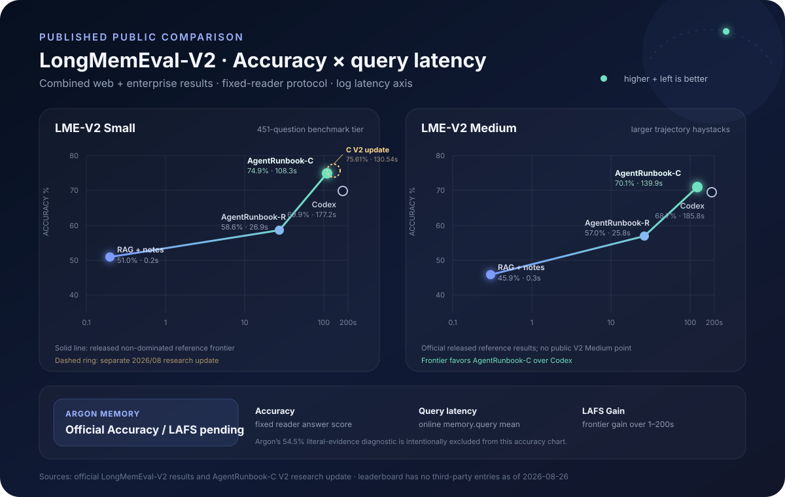

# Public benchmarks

Argon Memory reports capability claims only on public, version-pinned benchmarks. Synthetic cases in this repository are smoke tests and regression gates; they are never presented as benchmark scores.

| Benchmark | Role | Coverage | Integration status |
|---|---|---|---|
| [LongMemEval-V2](https://github.com/xiaowu0162/LongMemEval-V2) | Primary | Long-horizon web and enterprise Agent trajectories, five memory abilities, multimodal evidence, answer quality, query latency, and the official LAFS frontier score | MCP adapter, persistence gate, and public retrieval probe implemented |
| [MemoryAgentBench](https://github.com/HUST-AI-HYZ/MemoryAgentBench) | Secondary | Accurate retrieval, test-time learning, long-range understanding, and conflict resolution | Adapter planned after the primary run is frozen |

The primary integration is under [`longmemeval_v2/`](longmemeval_v2/). See the [benchmarking policy](../docs/benchmarking.md) for the reporting contract and the first [public retrieval diagnostic](../docs/benchmark-results/2026-08-26-longmemeval-v2-public-retrieval.md) for bounded current evidence.

## Published memory-system comparison

The official LongMemEval-V2 release reports the following combined Web + Enterprise reference results. All rows use the benchmark's fixed-reader protocol. Accuracy is end-to-end answer accuracy; latency is the mean online `memory.query` latency.

| Published system | Family | Small accuracy | Small latency | Medium accuracy | Medium latency |
|---|---|---:|---:|---:|---:|
| RAG: query → slice + notes | RAG | 51.0% | 0.2 s | 45.9% | 0.3 s |
| AgentRunbook-R | RAG + structured memory pools | 58.6% | 26.9 s | 57.0% | 25.8 s |
| Codex | General coding-agent retrieval | 69.9% | 177.2 s | 68.7% | 185.8 s |
| AgentRunbook-C | File-based coding-agent memory | **74.9%** | **108.3 s** | **70.1%** | **139.9 s** |
| **Argon Memory** | MCP project memory | **Pending official run** | **Pending** | **Pending official run** | **Pending** |

The separate August 2026 AgentRunbook-C V2 research update reports `75.61% / 130.54 s` on Small with GPT-5.4-mini at xhigh reasoning. It is shown as a dashed research-update point, not as a live leaderboard entry. The official leaderboard currently says that entries are coming soon.

### Architectural contrast — not a score

| System | Durable memory shape | Query-time controller | Distinguishing behavior |
|---|---|---|---|
| RAG: query → slice + notes | Raw state slices + trajectory notes | Retrieval pipeline | Fastest published reference point; limited active exploration |
| AgentRunbook-R | Raw slices + transition events + procedure/hint pools | Structured RAG | Separates state, dynamics, procedures, and gotchas |
| Codex baseline | Trajectory files | General coding agent | Actively searches files, with high query latency |
| AgentRunbook-C | Trajectory files + workflow docs + memory manifests | Purpose-built coding-agent controller | Strongest released reference accuracy/latency frontier |
| AgentRunbook-C V2 | File memory + reusable strategy note | Lightweight shell/editor controller + consolidation agent | Adds label-free query-strategy reuse across questions |
| **Argon Memory** | Project brief + topic memories + graph + immutable Artifacts/revisions | Client Agent over MCP + bounded server retrieval | Project lifecycle, evidence provenance, conflict disclosure, and multi-client closeout; official score pending |

This feature table compares public designs, not benchmark quality. In particular, Argon's project-governance features do not imply a LongMemEval-V2 advantage until the fixed-reader evaluation is complete.

| Public metric | Meaning | Comparison rule |
|---|---|---|
| Answer accuracy | Correct answers from the fixed reader after memory context gathering | Compare only under the same reader, evaluator, tier, domains, and context budget |
| Query latency | Mean online time spent in `memory.query` | Lower is better; report together with accuracy |
| LAFS | Best reachable accuracy averaged over log-scaled latency budgets from 1–200 s | A frontier-level metric, not a per-system accuracy alias |
| LAFS Gain | Improvement after adding a submission to the released reference frontier | `0` means the submission does not improve any latency budget |

Sources: [official benchmark results and LAFS definition](https://xiaowu0162.github.io/longmemeval-v2/#leaderboard), [official reproducibility repository](https://github.com/xiaowu0162/LongMemEval-V2), and the [AgentRunbook-C V2 research update](https://xiaowu0162.github.io/longmemeval-v2/agentrunbook-c-v2/).

This table deliberately does not mix scores from LoCoMo, LongMemEval-V1, or vendor-specific evaluations. Mem0, Letta, Zep/Graphiti, and other memory products do not currently have an official LongMemEval-V2 result in the public leaderboard, so a numeric cross-benchmark ranking would be misleading.

## Current Argon retrieval ablation

| Configuration | Literal evidence coverage | Mean query latency | Mean returned context | Decision |
|---|---:|---:|---:|---|
| Argon top 6 | **6/11 (54.5%)** | **1.62 s** | **12,170 tokens** | Selected |
| Argon top 10 | 4/11 (36.4%) | 1.77 s | 12,283 tokens | Rejected: evidence fragments became too short |

This is an ablation over the same 20 public questions and 12,000-token budget. Literal evidence coverage is a post-retrieval diagnostic, not LongMemEval-V2 answer accuracy or LAFS.
