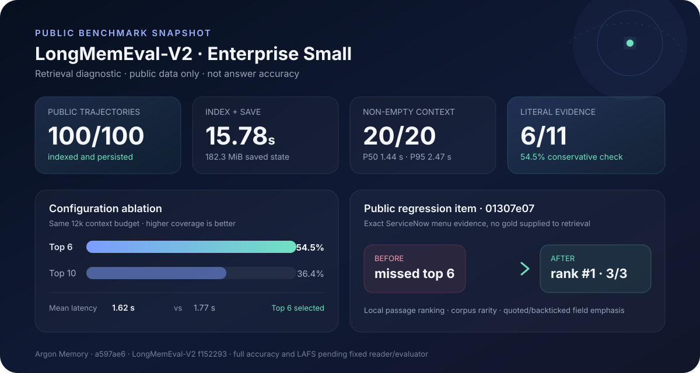

# LongMemEval-V2 public retrieval diagnostic — 2026-08-26

> **Claim level:** public retrieval diagnostic, not an official answer-accuracy or leaderboard result.

For the official RAG, AgentRunbook, and Codex accuracy/latency reference points, see the [published memory-system comparison](../../benchmarks/README.md#published-memory-system-comparison). Argon is intentionally shown there as `pending`, because this report does not run the fixed reader or evaluator.

This run tests Argon Memory through the official LongMemEval-V2 `Memory` interface and Argon's public Streamable HTTP MCP boundary. It measures public-data ingestion, persistence, reload, retrieval latency, context size, and narrow post-retrieval evidence presence. It does not call a reader or evaluator model.

## Reproducibility manifest

| Input | Pinned value |
|---|---|
| Argon Memory implementation | `a597ae6` |
| LongMemEval-V2 harness | `2cc8c540bdb87fe6761629b585e727e1c4704520` |
| LongMemEval-V2 dataset | `f152293e235517d504809563c833d7190b8c713b` |
| `trajectories.jsonl` SHA-256 | `363cec9a8e87aa8d9101ce4e600aadbf7031d674056ebe4f969e8424abc5f3c6` |
| `questions.jsonl` SHA-256 | `0a3ae5ebea938c24d7800e1e0b0828e08ae1646f939a53853b2b8cdc08e292b7` |
| `lme_v2_small.json` SHA-256 | `9b5301defb23a088a5f06e45ff8d5f35e569d78305a66d492046a9fff9b46593` |
| Domain and tier | `enterprise`, `small` |
| Questions | First 20 public enterprise questions in dataset order |
| Shared haystack | 100 public trajectories |
| Retrieval configuration | top 6, 12,000-token adapter budget, max 3 images |
| Runtime | macOS arm64, Node.js 25.7.0, Python 3.14.4 |

Only text trajectories were used. The separate multi-gigabyte trajectory screenshot archives were not present, none of these 20 questions had a question image, and query images do not yet influence Argon ranking.

## Results

### Ingestion and persistence

| Metric | Result |
|---|---:|
| Trajectories inserted | 100 / 100 |
| End-to-end index and save time | 15.78 s |
| Mean insertion latency | 98.59 ms / trajectory |
| P50 / P95 insertion latency | 99.48 / 147.83 ms |
| Saved Argon state | 182.3 MiB |
| Process maximum resident set during official loader run | 3.06 GiB |
| Save, reload, and retrieval gate | Passed |

The memory state remained human-inspectable Markdown plus Argon records. The high process maximum is dominated by the official harness loading the 1.2 GB trajectory JSON before selecting the 100-item small haystack; it is not the steady-state MCP server footprint.

### Twenty-question retrieval slice

| Metric | Result |
|---|---:|
| Non-empty memory contexts | 20 / 20 |
| Mean query latency | 1,617.50 ms |
| P50 / P95 query latency | 1,443.70 / 2,471.43 ms |
| Mean estimated returned context | 12,169.9 tokens |
| Phrase-set questions eligible for literal coverage check | 11 / 20 |
| All gold phrases literally present in retrieved context | 6 / 11 (54.5%) |

Gold answers were checked only after `memory.query` returned and were never passed into retrieval. Literal presence is not answer accuracy. In particular, a reasoning item whose answer is a computed word such as “six” can have the needed options in context without the final word appearing; conversely, a phrase appearing somewhere does not prove that a reader will answer correctly.

The first public item, `01307e07`, served as a regression case. The previous whole-document boolean scorer returned generic ServiceNow trajectories and omitted the exact evidence. The general local-passage ranker in `a597ae6` placed the relevant Artifact first and returned all three needed menu labels: `Incident Mobile`, `Incident Portal`, and `My Open Incidents`. The retrieval path saw only the question, never those gold strings.

### Per-question audit summary

`literal` is `n/a` when the official item is not a deterministic phrase-set question.

| Question | Type | Literal | Latency ms | Top record |
|---|---|---:|---:|---|
| `01307e07` | dynamic-environment | yes | 1376.142 | `artifact:argon:8af714bff558ed39ea565fc0` |
| `025db8ef` | procedure | yes | 2130.000 | `artifact:argon:ce38cc111633e76ceaefac2b` |
| `057a2d4d` | static-environment | yes | 1443.696 | `artifact:argon:a032000b2238bb7805d088f3` |
| `059974dd` | procedure-abs | n/a | 1740.879 | `artifact:argon:443f0b1f9a0223700ad2ffae` |
| `07ffeedf` | procedure | n/a | 2471.433 | `artifact:argon:a653ae444f42be31db3e12af` |
| `080b0218` | static-environment | yes | 1478.498 | `artifact:argon:a032000b2238bb7805d088f3` |
| `0b50ca0d` | procedure | n/a | 2337.334 | `artifact:argon:5bccaafd307b73d920ab311e` |
| `0cf979c4` | static-environment | no | 1568.733 | `artifact:argon:c8305c7b79132550fc14c25e` |
| `0d07143c` | dynamic-environment | no | 1400.379 | `artifact:argon:ed592d521fb21bccd04e6c31` |
| `0f8c85a6` | static-environment | no | 1053.082 | `artifact:argon:39d0b5c98463c6ae4e9f9a85` |
| `0f970f01` | static-environment | yes | 1206.049 | `artifact:argon:15e2070cf0c90bd0bd1e6f05` |
| `100ff132` | procedure | n/a | 2793.116 | `artifact:argon:a653ae444f42be31db3e12af` |
| `106c321b` | static-environment | no | 1568.183 | `artifact:argon:c8305c7b79132550fc14c25e` |
| `109b334c` | dynamic-environment-abs | n/a | 1693.416 | `artifact:argon:358ebb80c7b7236df528d426` |
| `11cc7ac2` | dynamic-environment-abs | n/a | 1254.825 | `artifact:argon:5b9ae45aebb031565bd17706` |
| `12286151` | dynamic-environment-abs | n/a | 1814.428 | `artifact:argon:3b5e045e4a286199c4d5aaaa` |
| `123b74fb` | static-environment-abs | n/a | 1172.935 | `artifact:argon:46ff2e282e54158f44457299` |
| `12f8cfd2` | procedure-abs | n/a | 1322.138 | `artifact:argon:5b02a14d116863d4830e6a30` |
| `14a823df` | dynamic-environment | yes | 1267.764 | `artifact:argon:782e8bec597ac436bdae0c66` |
| `17a03f9b` | static-environment | no | 1256.913 | `artifact:argon:5b02a14d116863d4830e6a30` |

## Rejected configuration

A top-10 retrieval experiment under the same 12,000-token budget reduced complete literal coverage to 4/11 (36.4%), increased mean latency to 1,769.72 ms, and returned shorter fragments per record. It was rejected in favor of top 6. This comparison is a tuning diagnostic, not an independent benchmark result.

## What remains before an accuracy claim

The next acceptance gate is an official answer run across both `enterprise` and `web`, using the fixed `Qwen/Qwen3.5-9B` reader, official evaluator, identical context budget, declared cost, baseline methods, and the upstream packaging validator. Until that completes, Argon Memory makes no LongMemEval-V2 accuracy or LAFS claim.
